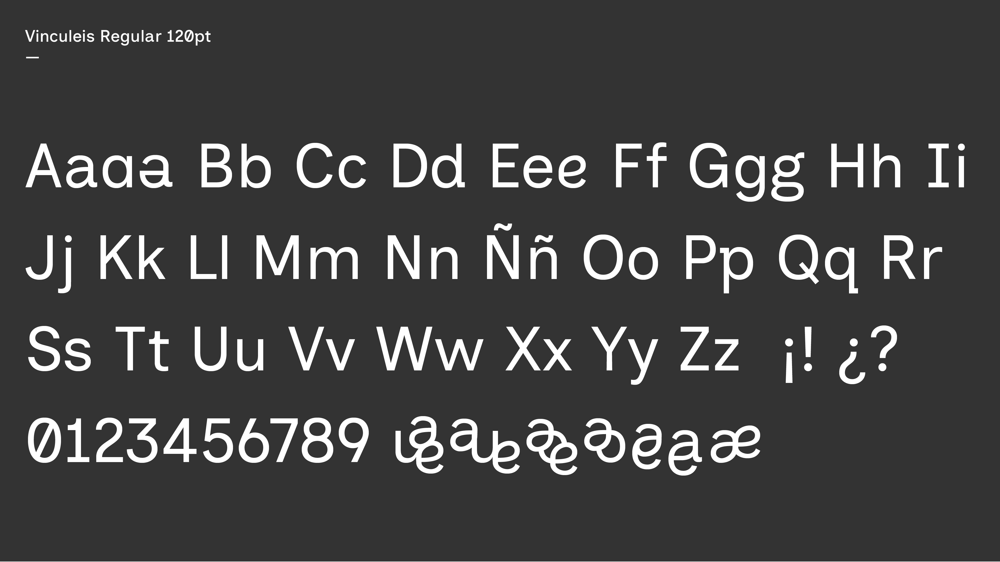
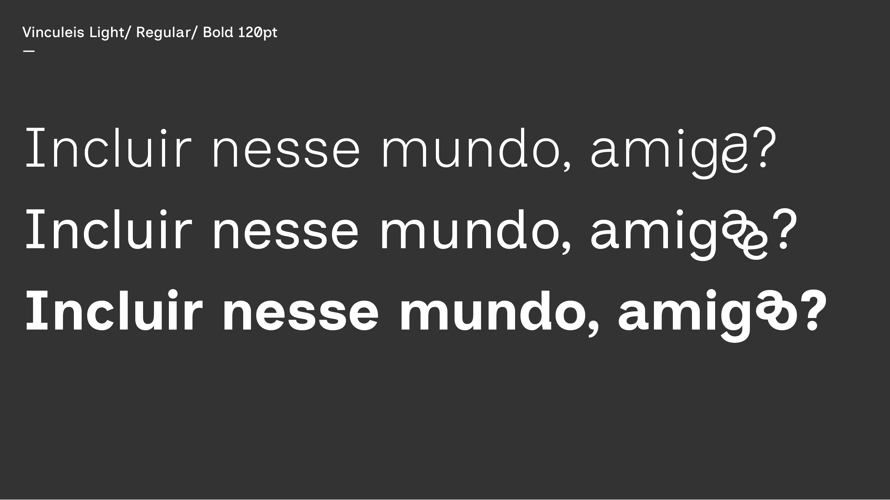
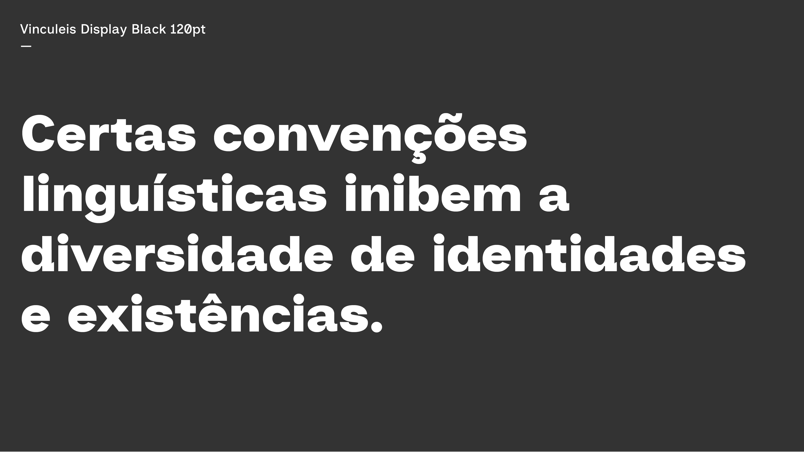

# Vinculeis

Vinculeis is a contemporary, inclusive sans-serif with support for gender-neutral Portuguese and a bold Display Black style.

## About

Vinculeis is a contemporary sans-serif typeface designed with accessibility and inclusive communication at its core. The name is an anagram of “Inclusive,” reflecting its origin: a thoughtful adaptation of the Inclusive Sans font. While preserving the clarity and readability essential to accessible typography, Vinculeis introduces subtle stylistic updates for a more contemporary feel.

Created within the framework of the project Práticas Coletivas em Design Queer (Collective Practices in Queer Design), Vinculeis embodies reflections on inclusive practices, dissident bodies, and non-normative subjectivities. The typeface includes custom ligatures and supportive glyphs for gender-neutral and non-binary language in Portuguese, expanding the possibilities for inclusive writing.

Vinculeis comes in multiple styles, including a specially designed Display Black version optimized for large-scale use such as posters and headlines.

With its blend of utility and expression, Vinculeis is ideal for designers seeking a typeface that supports both clarity and social consciousness.

## License

This Font Software is licensed under the SIL Open Font License, Version 1.1.
This license is available with a FAQ at https://openfontlicense.org

## Repository Layout

This font repository structure is inspired by [Unified Font Repository v0.3](https://github.com/unified-font-repository/Unified-Font-Repository), modified for the Google Fonts workflow.
